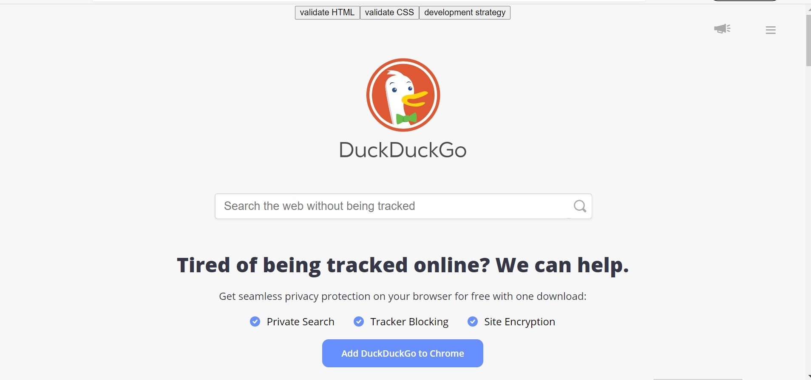

[![Contributors][contributors-shield]][contributors-url]
[![Issues][issues-shield]][issues-url]
[![MIT License][license-shield]][license-url]


  <h3 align="center">duck-duck-clone</h3>

  <p align="center">
    One project Three Juniors.
    <br />
    <a href="https://github.com/fmkarakus/duck-duck-clone"><strong>Explore the docs »</strong></a>
    <br />
    <br />
    <a href="https://github.com/fmkarakus/duck-duck-clone">View Demo</a>
    ·
    <a href="https://github.com/fmkarakus/duck-duck-clone/issues">Report Bug</a>
    ·
    <a href="https://github.com/fmkarakus/duck-duck-clone/issues">Request Feature</a>
  </p>
</p>


<!-- TABLE OF CONTENTS -->
## Table of Contents

* [About the Project](#about-the-project)
  * [Built With](#built-with)
* [Getting Started](#getting-started)
  * [Prerequisites](#prerequisites)
  * [Installation](#installation)
* [Contributing](#contributing)
* [License](#license)
* [Contact](#contact)
* [Acknowledgements](#acknowledgements)


<!-- ABOUT THE PROJECT -->
## About The Project




This project is for learning Incremental development with workflow and Pair programming. For the purpose of this project, the 3 junior developers were partnered together.

The objective of this project is to build our own accessible & responsive clone of the DuckDuckGo home page.

   > DuckDuckGo is an internet search engine that emphasizes protecting searchers' privacy and avoiding the filter bubble of personalized search results. 


### Built With

* [Visual studio code](https://code.visualstudio.com/)
* [Gitkraken](https://www.gitkraken.com)
* [GitHub](https://github.com)


<!-- GETTING STARTED -->
## Getting Started

To get a local copy up and running follow these simple steps.

### Prerequisites

This is an example of how to list things you need to use the software and how to install them.
* npm
```sh
npm install npm@latest -g
```

### Installation
 
1. Clone the repo
```sh
git clone https://github.com/fmkarakus/duck-duck-clone
```
2. Install NPM packages
```sh
npm install
```


<!-- ROADMAP -->
## Roadmap

See the [open issues](https://github.com/fmkarakus/duck-duck-clone/issues) for a list of proposed features (and known issues).


<!-- CONTRIBUTING -->
## Contributing

Contributions are what make the open source community such an amazing place to be learn, inspire, and create. Any contributions you make are **greatly appreciated**.

1. Fork the Project
2. Create your Feature Branch (`git checkout -b new-branch`)
3. Commit your Changes (`git commit -m 'Add some AmazingFeature'`)
4. Push to the Branch (`git push origin new-branch`)
5. Open a Pull Request


<!-- LICENSE -->
## License

Distributed under the MIT License. See `LICENSE` for more information.


<!-- CONTACT -->
## Contact

* [Fatih](https://fmkarakus.github.io/)
* [Gelila](https://gelilaa.github.io/)
* [Pavel](https://github.com/pavelbidenko2018)


Project Link: [duck-duck-clone](https://github.com/fmkarakus/duck-duck-clone)


<!-- ACKNOWLEDGEMENTS -->
## Acknowledgements

* [HYF](https://hackyourfuture.be/)
* [BEST readme template](https://github.com/othneildrew/Best-README-Template/blob/master/README.md)


<!-- MARKDOWN LINKS & IMAGES -->
<!-- https://www.markdownguide.org/basic-syntax/#reference-style-links -->
[contributors-shield]: https://img.shields.io/github/contributors/othneildrew/Best-README-Template.svg?style=flat-square
[contributors-url]: https://github.com/othneildrew/Best-README-Template/graphs/contributors
[forks-shield]: https://img.shields.io/github/forks/othneildrew/Best-README-Template.svg?style=flat-square
[forks-url]: https://github.com/othneildrew/Best-README-Template/network/members
[stars-shield]: https://img.shields.io/github/stars/othneildrew/Best-README-Template.svg?style=flat-square
[stars-url]: https://github.com/othneildrew/Best-README-Template/stargazers
[issues-shield]: https://img.shields.io/github/issues/othneildrew/Best-README-Template.svg?style=flat-square
[issues-url]: https://github.com/othneildrew/Best-README-Template/issues
[license-shield]: https://img.shields.io/github/license/othneildrew/Best-README-Template.svg?style=flat-square
[license-url]: https://github.com/othneildrew/Best-README-Template/blob/master/LICENSE.txt
[linkedin-shield]: https://img.shields.io/badge/-LinkedIn-black.svg?style=flat-square&logo=linkedin&colorB=555
[linkedin-url]: https://linkedin.com/in/othneildrew
[product-screenshot]: images/screenshot.png